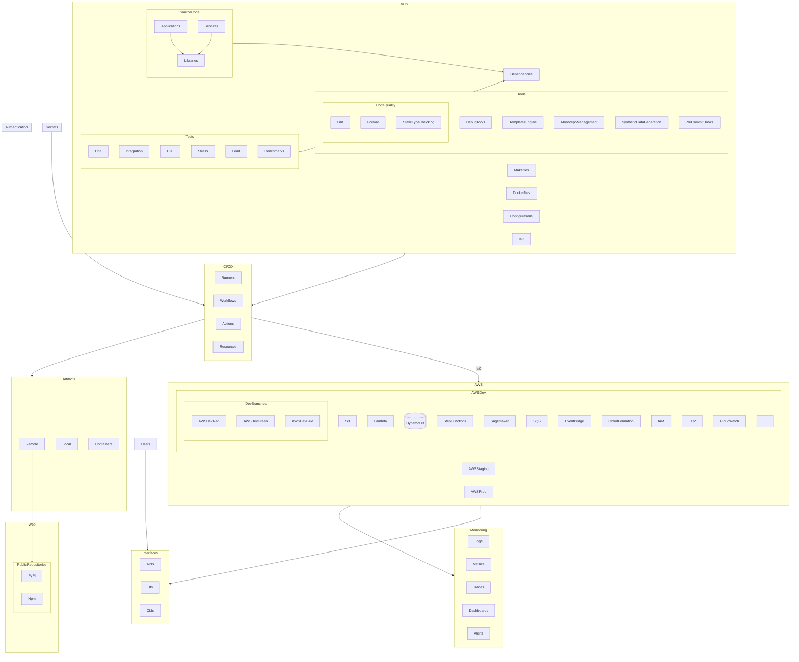

# Software Architectures

Playing field for playing around with new ideas and architectures for building, testing and deploying software.

## The Big Bang Architecture

```mermaid
flowchart
 subgraph AWS
  subgraph AWSDev
   S3
   Lambda
   DynamoDB[(DynamoDB)]
   StepFunctions
   Sagemaker
   SQS
   EventBridge
   CloudFormation
   IAM
   EC2
   CloudWatch
   ...

subgraph DevBranches
    AWSDevRed
    AWSDevGreen
    AWSDevBlue
    end
  end

  AWSStaging

  AWSProd
 end

 subgraph VCS
  subgraph SourceCode
   Applications
   Services
   Libraries
  end
  
  Dependencies

  subgraph Tests
   Unit
   Integration
   E2E
   Stress
   Load
   Benchmarks
  end

  subgraph Tools
   subgraph CodeQuality
    Lint
    Format
    StaticTypeChecking
   end

   DebugTools
   TemplatesEngine
   MonorepoManagement
   SyntheticDataGeneration
   PreCommitHooks
  end

  Makefiles
  Dockerfiles
  Configurations
  IaC
 end

 subgraph CI/CD
  Runners
  Workflows
  Actions
  Resources
 end

 subgraph Monitoring
  Logs
  Metrics
  Traces
  Dashboards
  Alerts
 end

 subgraph Secrets

 end

 subgraph Web
  subgraph PublicRepositories
   PyPi
   Npm
   ...
  end
 end

 subgraph Artifacts
  Remote
  Local
  Containers
 end

 subgraph Authentication
 end

 subgraph Interfaces
  APIs
  UIs
  CLIs
 end

 Applications --> Libraries
 Services --> Libraries

 Secrets --> CI/CD
 VCS --> CI/CD

 CI/CD --> Artifacts
 Remote --> PublicRepositories

 CI/CD --IaC--> AWS

 AWS --> Monitoring

 SourceCode --> Dependencies
 Tests --> Dependencies

 AWS --> Interfaces
 Users --> Interfaces
```
